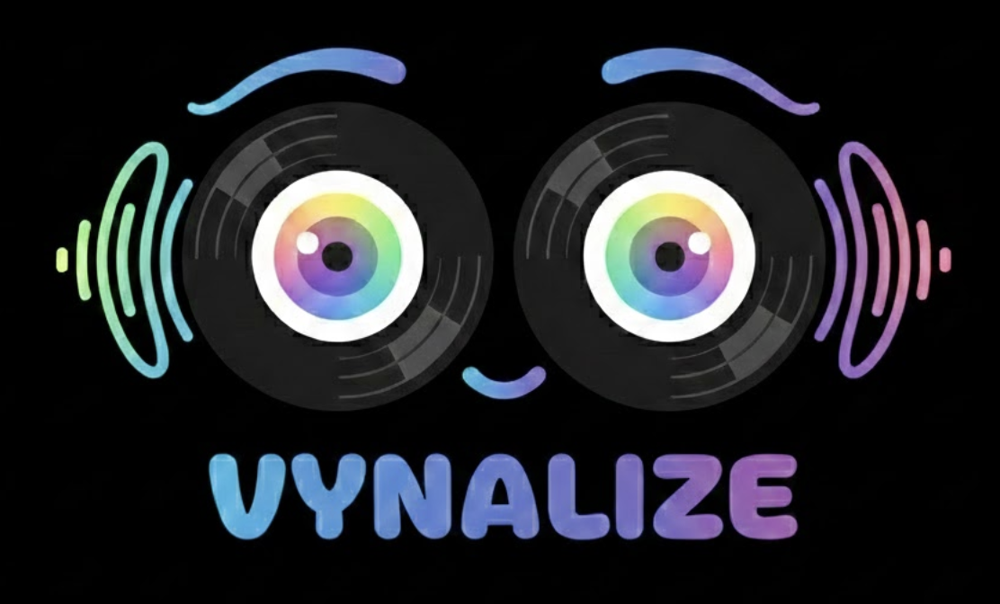

<p align="center">
  
</p>

# Vynalize Mobile

React Native remote control for [Vynalize](https://github.com/oaktech/vynalize) — a real-time audio visualizer. Replaces the browser-based `/remote` with a native app that supports Bonjour auto-discovery and background connectivity.

## Setup

```sh
npm install
cd ios && pod install && cd ..
```

## Run

```sh
# iOS
npx react-native run-ios

# Android
npx react-native run-android
```

## Architecture

```
src/
  types.ts                 # AppMode, VisualizerMode, SongInfo, WS messages
  store.ts                 # Zustand store (synced state from WebSocket)
  hooks/
    useWebSocket.ts        # Connect, send commands, receive state, auto-reconnect
    useDiscovery.ts        # Bonjour/mDNS scan for Vynalize server
  screens/
    ConnectScreen.tsx      # Cloud code entry, session validation, local server toggle
    RemoteScreen.tsx       # Now playing, mode selectors, visualizer carousel, video sync, sensitivity
App.tsx                    # Root — ConnectScreen or RemoteScreen based on connection
```

## How it works

1. **ConnectScreen** defaults to cloud mode (vynalize.com). The user enters a 6-character display code which auto-triggers connection on the 6th digit. A probe WebSocket validates the session before navigating — invalid codes show an inline error. A "Connect to local server" toggle reveals Bonjour/mDNS discovery and manual IP entry. Both server address and session code are persisted to AsyncStorage for auto-reconnect on next launch.

2. **RemoteScreen** connects via WebSocket (`ws[s]://<host>/ws?role=controller[&session=CODE]`) and mirrors the web remote UI — now playing info, app mode selector (Visual/Lyrics/Video/ASCII), 10 visualizer modes in an infinite-scroll carousel with prev/next arrows, video sync controls (±0.2s, visible in Video mode), and a sensitivity slider.

## WebSocket protocol

Connects to the existing Vynalize server. Cloud connections use `wss://` and include a `&session=CODE` parameter; local connections use `ws://`.

| Direction | Message |
|-----------|---------|
| Send | `{ type: 'command', action: 'setAppMode', value: AppMode }` |
| Send | `{ type: 'command', action: 'setVisualizerMode', value: VisualizerMode }` |
| Send | `{ type: 'command', action: 'adjustSensitivity', value: number }` |
| Send | `{ type: 'command', action: 'nextVisualizer' }` / `prevVisualizer` |
| Send | `{ type: 'command', action: 'adjustVideoOffset', value: number }` |
| Receive | `{ type: 'state', data: { visualizerMode, appMode, accentColor, sensitivityGain } }` |
| Receive | `{ type: 'song', data: SongInfo \| null }` |
| Receive | `{ type: 'beat', bpm: number \| null }` |

## Dependencies

| Package | Purpose |
|---------|---------|
| `zustand` | State management |
| `react-native-zeroconf` | Bonjour/mDNS service discovery |
| `@react-native-async-storage/async-storage` | Persist last server + settings |
| `@react-native-community/slider` | Native slider component |
| `react-native-safe-area-context` | Safe area insets for notch/home indicator |
